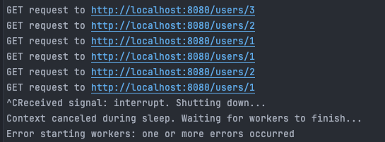
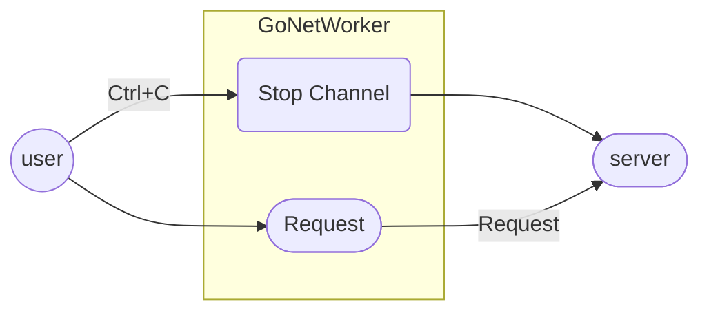

## GoNetWorker
GoNetWorker는 운영 환경을 학습하기 위한 **네트워크 기반 시뮬레이션 도구**입니다. 

### endpoint.json
endpoint.json은 GoNetWorker가 요청할 endpoint에 대한 정보를 정의합니다.

| Key   | Value             | Describe         |
| ----- | ----------------- | ---------------- |
| works | uri, port, []task | endpoint에 대한 정보  |
| tasks | path, method      | 요청하고자 하는 경로와 메소드 |

```json
{
  "settings": {
    "sleep_range" : 5 
  },
  "works": [
    {
      "uri": "http://localhost",
      "port": 8080,
      "tasks": [
        {
          "path": "/users/{[1-3]}",
        }
      ]
    }
  ]
}
```
### How to use
make 명령어를 통해 빌드 후 실행합니다.

```shell
make // Build 
./gonetworker // Execute
```

`ctrl + c`를 통해 프로그램을 종료할 수 있습니다.




### Update 

#### v.1.0.4
- Body에 대한 설정 추가
  - key : key의 변수 타입으로 지정 
  - int인 경우 Regex를 활용하여 범위 지정 가능 

- 사용 가능한 변수 타입
    - string
    - int 

```json 
"body": {
  "name": "string",
  "age1": "int",
  "age2": "{[1-100]}"
}
```

#### v.1.0.3
- Regex를 활용한 Request Path 지정

```json
"path": "/users/{[1-3]}" 
```

### 구조


